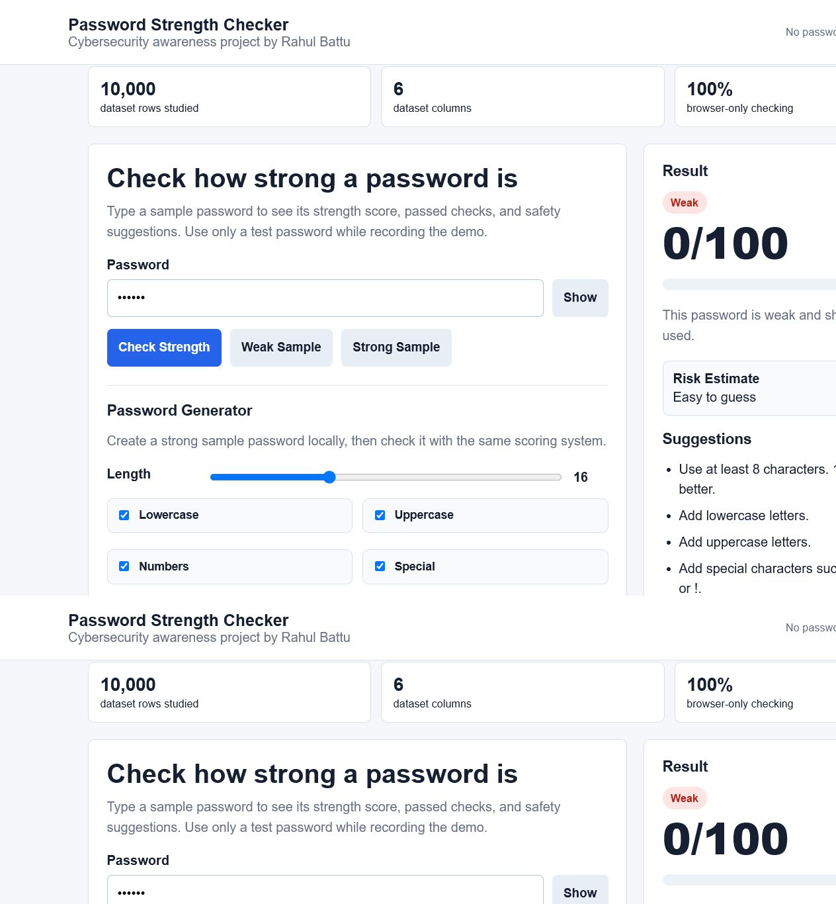
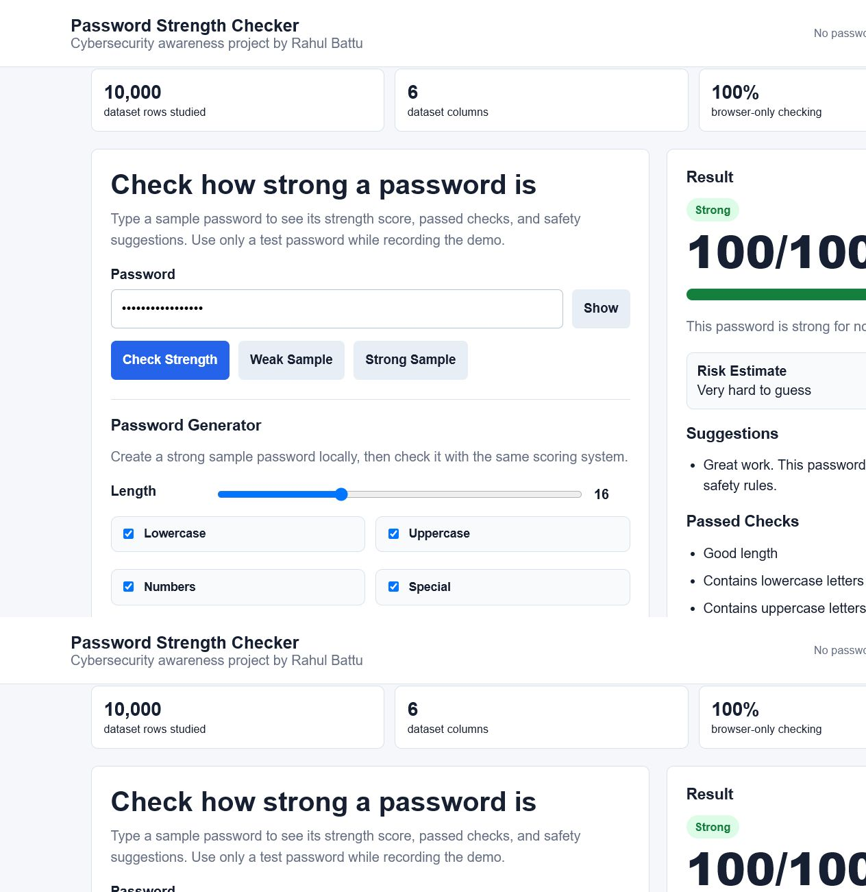
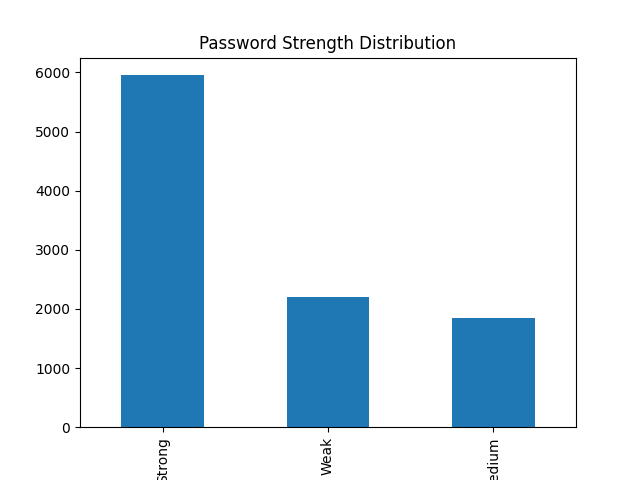
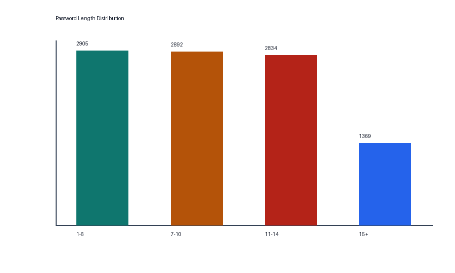

Password Strength Checker

Author: Rahul Battu

Internship: CodeZoner Cybersecurity Portfolio Project

Repository: https://github.com/rahulbattu15-boop/password-strength-checker

Live Demo

Live link: https://rahulbattu15-boop.github.io/password-strength-checker/

## Problem Statement

Weak passwords are a reason for account hacking and cybersecurity breaches. Many students create passwords that're too simple or do not use special characters. This project helps users understand password safety by checking password length, character variety, common patterns, repeated characters and simple sequences

## Solution

The Password Strength Checker is a tool that checks a sample password and gives a strength result: Weak, Medium or Strong. It also provides suggestions to improve the password. The project includes dataset analysis, data cleaning, feature engineering, visualizations a Python password-checking script and a browser demo. The demo runs fully inside the browser. Does not save or upload passwords.
## Features

* Checks password length

* Checks for lowercase and uppercase letters

* Checks for numbers

* Checks for characters

* Warns against passwords

* Warns against repeated characters and simple sequences

* Shows a score out of 100

* Shows Weak, Medium or Strong result

* Gives improvement suggestions

* Includes dataset analysis and charts

* Includes a browser-based demo in index.html

## Screenshots

### Web Demo - Weak Password



### Web Demo - Strong Password



### Password Strength Distribution



### Password Length Distribution



## Dataset Information

The dataset is stored in the data folder.

* dataset: data/passwords_dataset.csv

* Cleaned dataset: data/cleaned_passwords_dataset.csv

* Feature dataset: data/password_features.csv

* Rows: 10,000

* Main columns: Password, Length, Strength, Has Lowercase, Has Uppercase, Has Special Character

## Technologies Used

* Python

* pandas

* Pillow

* HTML

* CSS

* JavaScript

* Git and GitHub

## Project Structure

```text
password-strength-checker/
├── index.html
├── README.md
├── requirements.txt
├── data/
│   ├── passwords_dataset.csv
│   ├── cleaned_passwords_dataset.csv
│   └── password_features.csv
├── docs/
│   ├── day3_insights.md
│   ├── day4_insights.md
│   ├── day5_insights.md
│   ├── project_report.md
│   ├── final_submission_description.md
│   ├── demo_video_script.md
│   ├── strength_distribution.png
│   └── password_length_distribution.png
└── src/
    ├── data_exploration.py
    ├── data_cleaning.py
    ├── feature_engineering.py
    └── password_checker.py
```

## Setup Steps

1. Clone or download this repository.
2. Install Python dependencies:

```bash
pip install -r requirements.txt
```

3. Run data exploration:

```bash
python src/data_exploration.py
```

4. Run data cleaning:

```bash
python src/data_cleaning.py
```

5. Run feature engineering:

```bash
python src/feature_engineering.py
```

6. Run the password checker:

```bash
python src/password_checker.py
```

7. Open `index.html` in a browser for the web demo.

## Results

* Average password length is 9.42 characters.

* Strong passwords are the majority class in the dataset.

* Weak passwords are mostly short. Have fewer character types.

*  Passwords with letters, lowercase letters, numbers and special characters are usually stronger.

## Security Note

Do not enter personal passwords, in demos or recordings. The browser demo checks the password locally. Does not save or upload it.

## Future Improvements

* Add a password generator

* Add leaked-password detection using an API

* Add a full mobile-friendly UI

* Add model-based password strength prediction

* Deploy the project using GitHub Pages, Netlify or Vercel