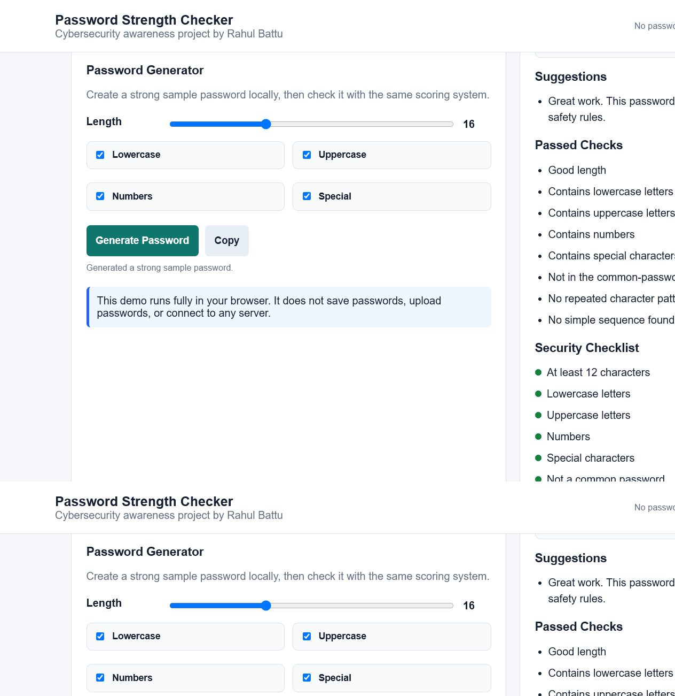

Password Strength Checker

Author: Rahul Battu

Internship: CodeZoner Cybersecurity Portfolio Project

Repository: https://github.com/rahulbattu15-boop/password-strength-checker

Live Demo

Live link: https://rahulbattu15-boop.github.io/password-strength-checker/

## Problem Statement

Weak passwords are a reason for account hacking and cybersecurity breaches. Many students create passwords that're too simple or do not use special characters. This project helps users understand password safety by checking password length, character variety, common patterns, repeated characters and simple sequences

## Solution

<<<<<<< HEAD
The Password Strength Checker is a tool that checks a sample password and gives a strength result: Weak, Medium or Strong. It also provides suggestions to improve the password. The project includes dataset analysis, data cleaning, feature engineering, visualizations a Python password-checking script and a browser demo. The demo runs fully inside the browser. Does not save or upload passwords.
=======
The Password Strength Checker is a tool that checks a sample password and gives a strength result: Weak, Medium or Strong. It also provides suggestions to improve the password. The project includes dataset analysis, data cleaning, feature engineering, visualizations, JavaScript checker logic and a browser demo. The demo runs fully inside the browser. It does not save or upload passwords.
>>>>>>> master
## Features

* Checks password length

* Checks for lowercase and uppercase letters

* Checks for numbers

* Checks for special characters

* Warns against common passwords

* Warns against repeated characters and simple sequences

* Shows a score out of 100

* Shows Weak, Medium or Strong result

* Gives improvement suggestions

* Shows passed password checks in the browser demo

<<<<<<< HEAD
=======
* Generates strong sample passwords locally

* Lets users choose generated password length and character types

* Shows a security checklist

* Shows a simple risk estimate

* Includes a copy button for generated sample passwords

>>>>>>> master
* Includes basic JavaScript tests for the checker logic

* Includes dataset analysis and charts

* Includes a browser-based demo in index.html

## Screenshots

### Web Demo - Weak Password


### Web Demo - Strong Password


<<<<<<< HEAD
=======
### Web Demo - Password Generator



>>>>>>> master
### Password Strength Distribution


### Password Length Distribution


## Dataset Information

The dataset is stored in the data folder.

* dataset: data/passwords_dataset.csv

* Cleaned dataset: data/cleaned_passwords_dataset.csv

* Processed cleaned dataset: data/processed/cleaned_passwords_dataset.csv

* Feature dataset: data/password_features.csv

* Rows: 10,000

* Main columns: Password, Length, Strength, Has Lowercase, Has Uppercase, Has Special Character

## Technologies Used
<<<<<<< HEAD
Mostly used HTML,CSS, JavaScript
* Python

* pandas

* Pillow
=======
Mostly used HTML, CSS and JavaScript
>>>>>>> master

* HTML

* CSS

* JavaScript

* Git and GitHub

## Project Structure

```text
password-strength-checker/
├── index.html
├── README.md
├── requirements.txt
├── src/
│   └── password_checker.js
├── tests/
│   └── password_checker.test.js
├── data/
│   ├── passwords_dataset.csv
│   ├── cleaned_passwords_dataset.csv
│   ├── password_features.csv
│   └── processed/
│       └── cleaned_passwords_dataset.csv
└── docs/
     ├── day3_insights.md
     ├── day4_insights.md
     ├── day5_insights.md
     ├── day8_core_feature_1.md
     ├── day9_core_feature_2.md
     ├── day10_core_feature_3.md
     ├── day11_validation_error_handling.md
     ├── day12_testing.md
     ├── day13_bug_fixes_polish.md
     ├── day14_week2_review.md
<<<<<<< HEAD
     ├── week2_report.md
=======
     ├── day15_advanced_feature_1.md
     ├── day16_advanced_feature_2.md
     ├── day17_ui_design_polish.md
     ├── day18_performance_optimization.md
     ├── day19_user_testing.md
     ├── day20_user_testing_fixes.md
     ├── day21_week3_review.md
     ├── week2_report.md
     ├── week3_report.md
     ├── week4_plan.md
>>>>>>> master
     ├── project_report.md
     ├── final_submission_description.md
     ├── demo_video_script.md
     ├── strength_distribution.png
     └── password_length_distribution.png
....

## Setup Steps

1. Clone or download this repository.
<<<<<<< HEAD
Removed because it has not been used for a long time(2-6)
2. Install Python dependencies:

```bash
pip install -r requirements.txt
```

3. Run data exploration:

```bash
python src/data_exploration.py
```

4. Run data cleaning:

```bash
python src/data_cleaning.py
```

5. Run feature engineering:

```bash
python src/feature_engineering.py
```

6. Run the password checker:
=======

2. Run the checker tests:
>>>>>>> master

```bash
node tests/password_checker.test.js
```

<<<<<<< HEAD
7. Open `index.html` in a browser for the web demo.

8. The Week 2 daily work is documented in `docs/day8_core_feature_1.md` through `docs/day14_week2_review.md`.
=======
3. Open `index.html` in a browser for the web demo.

4. The Week 2 daily work is documented in `docs/day8_core_feature_1.md` through `docs/day14_week2_review.md`.

5. The Week 3 daily work is documented in `docs/day15_advanced_feature_1.md` through `docs/day21_week3_review.md`.
>>>>>>> master

## Results

* Average password length is 9.42 characters.

* Strong passwords are the majority class in the dataset.

* Weak passwords are mostly short. Have fewer character types.

*  Passwords with letters, lowercase letters, numbers and special characters are usually stronger.

* Week 2 core features are complete: password scoring, improvement suggestions and browser demo integration.

<<<<<<< HEAD
=======
* Week 3 advanced features are complete: password generator, checklist, risk estimate and UI polish.

>>>>>>> master
## Security Note

Do not enter personal passwords in demos or recordings. The browser demo checks the password locally. Does not save or upload it.

## Future Improvements

<<<<<<< HEAD
* Add a password generator

* Add leaked-password detection using an API

* Add a full mobile-friendly UI

=======
* Add leaked-password detection using an API

>>>>>>> master
* Add model-based password strength prediction

* Deploy the project using GitHub Pages, Netlify or Vercel
